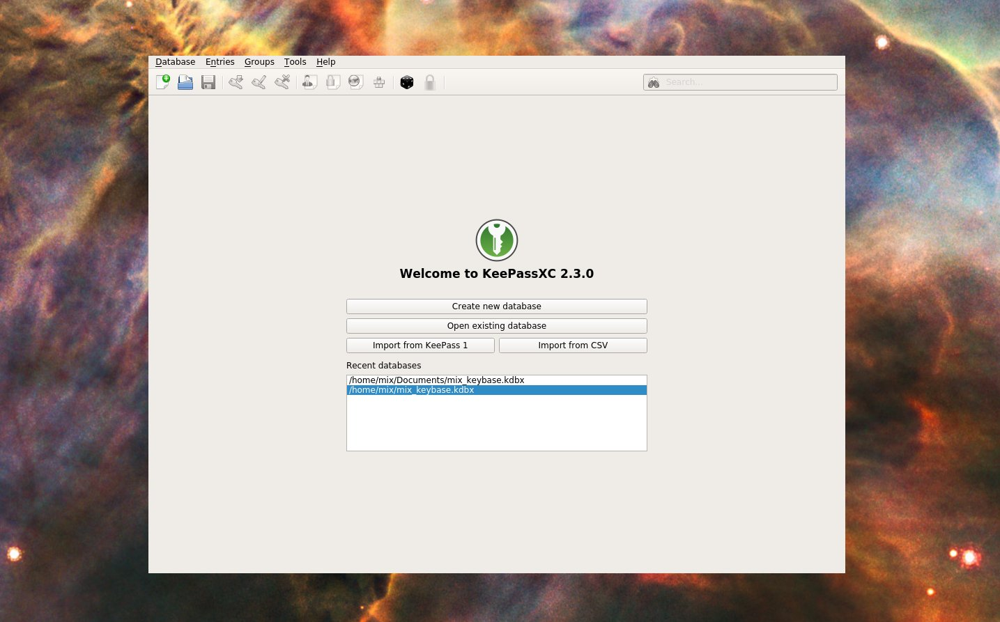
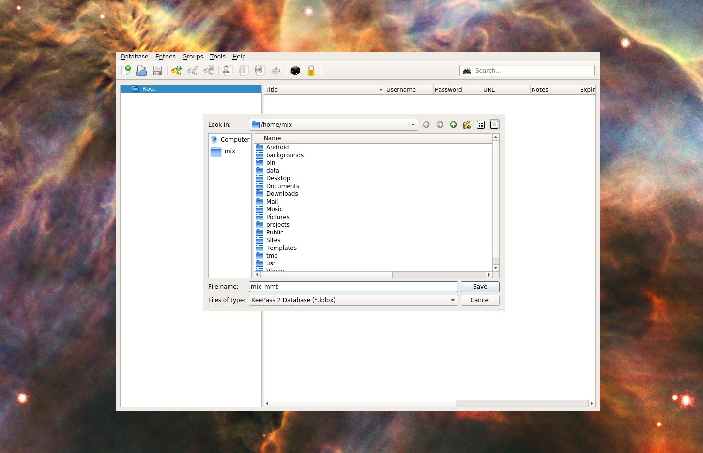
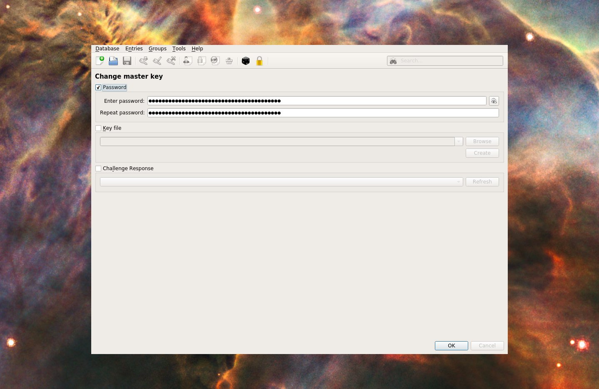
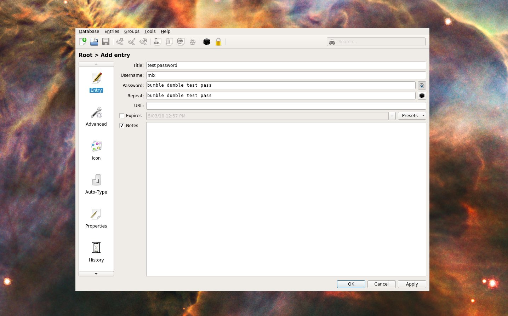
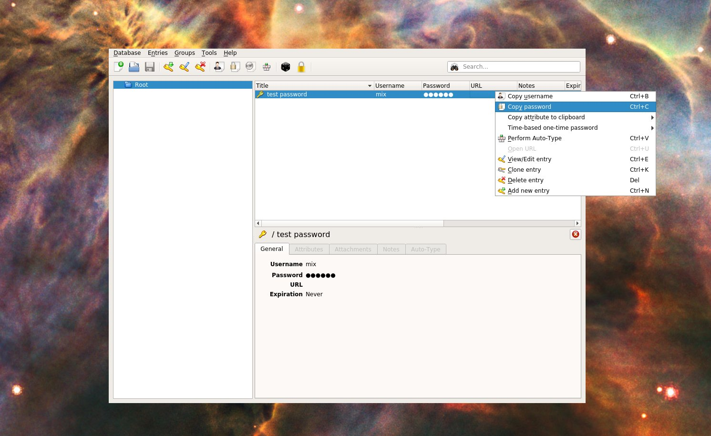

# Bitcoin setup guide (Beginners)

This guide is a lite opinionated guide to getting a bitcoin setup with reasonable reliability established.

**What you will need:**

- your own computer :computer: 
- 5 people you trust :family: (to give backup details)
- enough time :clock1: to follow steps slowly and not slip up

If you want more detail please [see **in-depth guide**](https://docs.google.com/document/d/11fJfWa5a6FX8h-2zGI5ZZFm7bNKGN6L1wWhnfrUOMQg/edit#heading=h.q9r9wfywrj12) for more details.

## Overview of Steps

1. [Setup password manager](#1-Setup-password-manager)
2. [Setup bitcoin wallet](#2-Setup-bitcoin-wallet)
3. [Share backup of seed](#3-Share-backup-of-your-seed)
4. [Security Audit](#4-Security-Audit)
5. [Receive a small test payment](#5-Receive-a-small-test-payment)

**Notes**
  - if you're unclear on anything, please ask.
  - :warning: = `this is a dangerous step, follow it exactly`
  - if the images are too small, make the text on your browser bigger
    - e.g. `ctrl + "+"` or `cmd + "+"`

## 1. Setup password manager

We're going to be working with really long secure passwords.
Good news is, all you you need is an excellent password manager and it can remember all these long passwords.
We will make this safe by setting up on one single single "Master Password" which you need to know to get into the password manager.

If you've got questions as you go, check the FAQ at the bottom of this section

**What you need for this section**:
- Read over the steps before you start
- 1 Master Password
- The start of a security mindset - can someone else get into this? Can I get back into this?

1. Install KeePassXC - https://keepassxc.org/download/ (subsequently I'll just call it KeePass)

2. Open the software, start a new password database
    1. Click `[ Ceate new database ]`
      - (optional) see FAQ 'what is a database?'
      
    2. Give it a name that makes sense like "mix_mmt_passwords" and click `[ Save ]`
      
    
3. Choose your "Master Password"
    > Pay close attention, being lazy here will lose your money
    - this is the one password you have to remember
    - Never use this password _anywhere online_
    - Never use this password _for anything else_
    - Your passwod must be very hard for humans and computers to guess 
      - use a line from a song or poem you like 
      - e.g. "people say she's crazy she's got diamonds on the soles of her shoes"
      - yes make it quite long
    

4. Save a test password into the password manager, then retrieve it out
    - This is to get you used to using KeePass AND to **prove to yourself that your setup is working**
    - Save a password in:
      1. click `Entries > Add new entry` in the menu
      2. enter some test details (you need to enter the pass twice, you can click the eye to reveal the passwords). click `[ OK ]`
      
    - Get the password out:
      - right click on the new entry and copy the password. paste that password somewhere else to prove your password is in there ok
      - e.g. mine comes out "bumble dumble test pass", so it's worked!
      

5. Prove you can close everything and then retreive the password again
    - This is to force you to use your master password, and prove to yourself that you know how to do all this.
    - Close KeePass
    - Open KeePass (and enter your master password to unlock it and get in)
    - Check you can still see that test password (e.g. copy it out)

If you've got this all sorted, you're now ready to save your bitcoin passwords super securely!

### FAQ

- I've already got a password manager, can I just use that?
  - No. This is our opinionated recommendation about the simplest safest starting point
  - (advanced) yes perhaps, but we'd need to talk through the security. Please run with this to start with
- What's a **database**?
  - it's just a filing cabinet for storing things in! (In this case 'things' = data, like passwords)
  - with KeePass the database is just a special file, e.g. 'mix_mmt.kdbx`. If you delete that file, all the passwords in it will be lost.
  - KeePass lets you set up different databases, e.g. you might like to keep your work and personal passwords totally seperated. This is a more advanced case you don't need to worry about

## 2. Setup bitcoin wallet

We're now goint to install the wallet that holds your actual bitcoin.
You wallet will be 'grown' from a **Seed** - a special string of words which can be used to recreate everything about your wallet if you lose it. (This is essentially your "private key").

--> ** Dan: The seed is what grows your wallet. A wallet may contain many private keys**
--> ** Dan: For organisations we may also propose that a multisig wallet is actually the way to go, this would mean 2/3 or 3/5 or 5/7 signatories needed to spend funds... **

1. Install the Electrum wallet - [electrum.org/#download](https://electrum.org/#download) 

2. Start Electrum, and enter a name for your wallet
3. Select:  `Standard Wallet`, then `Create a new seed`, then `SegWit`
4. :warning: Make a new KeePass entry for the **Seed** phrase (string of words that's been generated)
    - open KeePass, and follow steps above used to make a `New Entry`
    - call the entry `Electrum Seed`, and paste the seed in as the password
5. Go to the next step and pass it by copying your the password from KeePass
    - right click on the password, select `copy password`
6. Make a password to encrypt your wallet
    - make a long password with https://www.rempe.us/diceware/#eff
    - save the password as `Electrum Password` in KeyPass
    - copy that password, enter it in Electrum, selecting `encrypt wallet`
7. Check you got everything saved right!
    - quit Electrum wallet, and open it again
    - use the `Electrum password` saved in KeePass

## 3. Share backup of your seed

So you've got this Seed - a phrase from which you can regrow your wallet. We need to protect your organisation against the eventuality that you get hit by a bus (OR your computer is lost).

There's a neat trick that lets you 'shard' (split) your seed into 5 parts. You can recreate your seed by bringing any 3 of the parts together again.

1. Copy your `Electrum Seed` (from KeePass) into https://secrets.dyne.org/share
2. :warning: Double check you just copied the seed phrase!
3. Click `Submit`
4. Send each of the 5 'shards' (one shard per line) to a different friend
    - (dyne calls shards 'shares')
    - send the shards over different comms channels
    - tell the person you're sending it to what it is!

5. (optional) Test you can put your seed back together
    - go to https://secrets.dyne.org/combine
    - paste in any 3 of the shards and click `submit`
    - compare with your original seed!

## 4. Security Audit

A few due dilligence questions:

- [ ] Are you in ownership of the private key? (seed)
- [ ] Have you backed up the private key?
- [ ] Have you confirmed all 5 of your trusted people have received a shard of you private key ? 

Technically that’s all I need, but unless the above are anwswered you are assuming the individual risk of the value of the tokens… is this risk you want to take on as an individual? There are ways we can mitigate this :)

## 5. Receive a small test payment

1. In Electrum, go to the Receive tab and copy your `Receive Address`
2. Give this address to someone who is going to send you bitcoin

